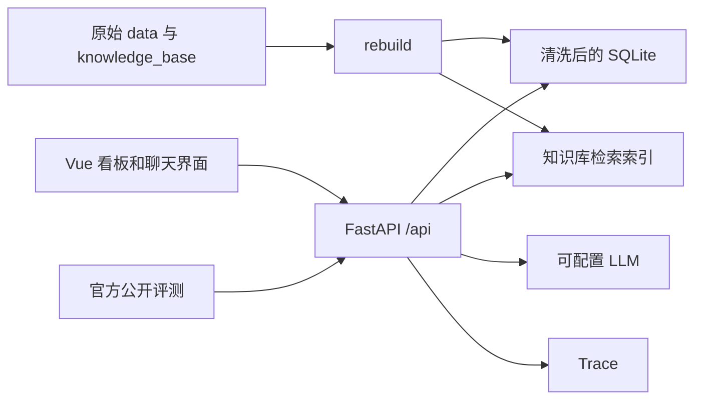

# Moneki 经营看板与混合问答：项目骨架

> 状态：**仅完成框架、官方文件导入与交接说明，尚未完成作业实现。** 指标、检索、问答和评测都需要后续开发。不要把本目录直接作为已完成作品提交。

## 这份目录包含什么

| 路径 | 用途 |
| --- | --- |
| `frontend/` | Vue 3 + TypeScript + Vite 的页面骨架；组件只显示待实现状态，不展示虚构经营数据 |
| `scripts/bootstrap-upstream.ps1` | 从官方仓库导入原始 `data/`、`knowledge_base/`、`starter/`、`eval/`、`docs/`；本目录已执行导入 |
| `IMPLEMENTATION_GUIDE.md` | 交给后续 AI 的详细实施顺序、接口要求、验证标准与交接提示词 |
| `DEBUG_LOG.md` 等 | 必交文档模板；必须用真实实验和输出填写 |

官方题目：[MorrisPRC/moneki-ai-takehome](https://github.com/MorrisPRC/moneki-ai-takehome)。接口以官方 [`docs/API_CONTRACT.md`](https://github.com/MorrisPRC/moneki-ai-takehome/blob/main/docs/API_CONTRACT.md) 为最终依据。

## 官方文件与重新导入

官方文件已从上游 commit `56f7a1f` 导入，包括 `data/pos.db`、35 份 `KB-xxx` 文档、`starter/kbqa/`、`eval/run_eval.py`、`docs/API_CONTRACT.md`。若需要在全新副本里重新导入，在本目录执行（Windows PowerShell）：

```powershell
pwsh -File scripts/bootstrap-upstream.ps1
```

本机若需通过正在运行的本地 HTTP 代理（例如 `127.0.0.1:7890`）访问 GitHub，可执行：

```powershell
pwsh -File scripts/bootstrap-upstream.ps1 -ProxyUrl 'http://127.0.0.1:7890'
```

脚本只复制官方文件，不修改 starter 代码。若 GitHub 网络不可用，先手动下载官方仓库 ZIP 并解压，再执行：

```powershell
pwsh -File scripts/bootstrap-upstream.ps1 -SourceDir 'C:\path\to\moneki-ai-takehome-main'
```

## 开发入口

导入后按官方 starter 文档使用 Python 3.12，在 `starter/` 安装 `requirements.txt`、运行重建和服务；在本目录运行 `python eval/run_eval.py --base-url http://localhost:8000 --questions eval/public_questions.jsonl`。前端进入 `frontend/` 后运行 `npm install`、`npm run dev`。现在前端只是页面骨架，后端仍是有缺陷的原始 starter，不能以页面启动成功代表作业完成。

详细任务顺序与验收见 [IMPLEMENTATION_GUIDE.md](IMPLEMENTATION_GUIDE.md)。

## 目标结构

```text
moneki-framework/
├─ data/                  # 官方原始数据，导入后出现
├─ knowledge_base/        # 官方知识库，导入后出现
├─ starter/               # 官方 FastAPI 服务，在此修复
├─ eval/                  # 官方公开评测与 LLM 预检
├─ docs/API_CONTRACT.md   # 官方接口契约
├─ frontend/              # 本框架新增的 Vue 页面
├─ scripts/
├─ IMPLEMENTATION_GUIDE.md
├─ README.md
├─ DEBUG_LOG.md
├─ EVAL_REPORT.md
├─ LLM_SETUP.md
├─ AI_USAGE.md
└─ DEMO.md
```

## 架构方向



选择沿用官方 Python starter，是为了保留可观察的缺陷修复过程；前端采用 Vue 3，是为了把看板、证据和追踪面板拆成独立视图。业务口径不能凭此图决定，必须以当前有效的 `KB-001` 和契约为准。

## 当前限制

官方文件已通过本地 HTTP 代理导入。尚未运行 starter、未取得初始分数，也未声称任何缺陷已修好。后续 AI 应先按 `IMPLEMENTATION_GUIDE.md` 建立真实基线。
