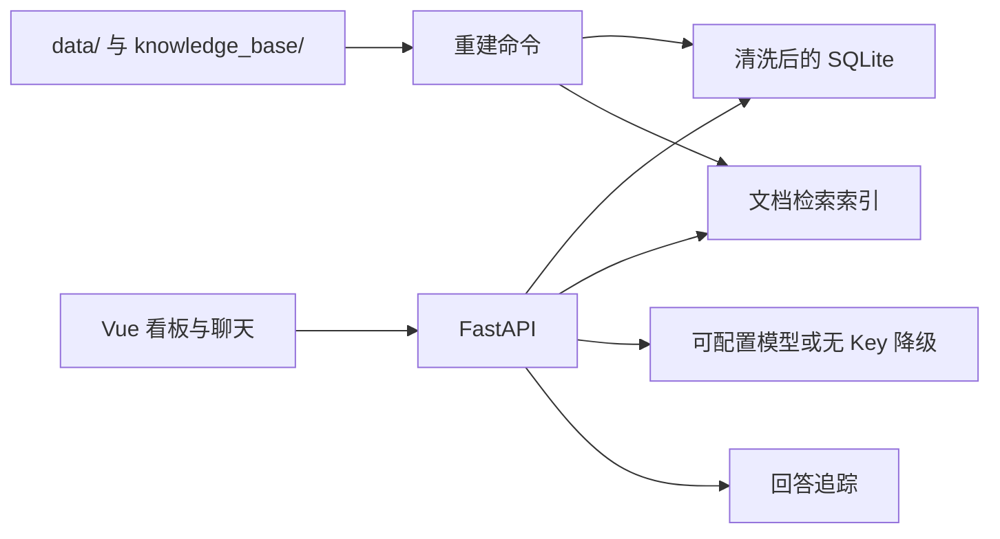

# Moneki 经营看板与混合问答

经营看板和带证据的问答服务。指标按现行 KB-001 从清洗后的销售明细计算，文档答案带逐字引用，没有模型 Key 时仍可启动和评测。

## 三步启动

需要 Python 3.12 和 Node.js。在仓库根目录：

1. 建立后端环境并安装依赖。

```powershell
cd starter
python -m venv .venv
.\.venv\Scripts\python.exe -m pip install -r requirements.txt
```

2. 重建数据和索引，启动后端。

```powershell
.\.venv\Scripts\python.exe -m kbqa.rebuild
.\.venv\Scripts\python.exe -m uvicorn kbqa.server:app --host 127.0.0.1 --port 8000
```

3. 另开一个终端，启动前端。

```powershell
cd frontend
npm install
npm run dev
```

看板在 `http://127.0.0.1:5173/`，接口代理到 `8000`。系统“今天”固定为 2026-09-01。
Windows 上如果 `python` 指向缺少 `venv` 的精简运行时，第一步改用已安装的 Python 3.12 完整路径；之后始终使用 `.venv` 内的解释器。

更换 `data/` 或 `knowledge_base/` 后，再执行一次 `python -m kbqa.rebuild`。索引键包含知识库文件字节，增删改文档后缓存会失效。不要把 API Key 写进仓库。

## 评测

无 Key 即可跑公开题：

```powershell
.\starter\.venv\Scripts\python.exe eval\run_eval.py --base-url http://127.0.0.1:8000 --questions eval\public_questions.jsonl
```

2026-09-26 这次无 Key 运行的总分是 **100.00 / 100.00**。明细见 `EVAL_REPORT.md`。

接入 DeepSeek 时设置 `LLM_BASE_URL`、`LLM_API_KEY`、`LLM_MODEL` 后重启服务。地址原样拼接 `/chat/completions`，不补 `/v1`。预检步骤见 `LLM_SETUP.md`。

## 目录

| 路径 | 用途 |
| --- | --- |
| `data/pos.db` | 原始销售库，清洗时只读 |
| `knowledge_base/` | KB 文档；`README.md` 不进索引 |
| `starter/kbqa/` | FastAPI 服务：清洗、指标、检索、问答、trace |
| `frontend/` | Vue 3 看板：日期和门店筛选、趋势、Top 10、数据质量、问答和 trace |
| `eval/` | 官方公开评测和 LLM 预检 |
| `docs/API_CONTRACT.md` | 接口契约 |

清洗结果在 `starter/var/clean.db`，索引在 `starter/.cache/index.json`，两者都已忽略，由重建命令生成。

## 架构与选型



沿用官方 Python starter，保留逐层定位和修复缺陷的过程；SQLite 适合这份本地 POS 数据，查询保持只读。文档检索使用可重建的本地索引，不依赖额外的向量服务或 Key；前端用 Vue 3 与 ECharts 展示趋势和证据。模型地址、名称和 Key 从环境变量读取，未配置 Key 时仍能运行指标、检索和降级问答。

口径以当前有效的 KB-001 为准：先规范化并按规定顺序剔除，再用销售和退款行计算净营业额；有效订单数按销售行的不同订单号计；退款按退款行日期归属。数据库与周报估算值冲突时，以数据库查询为准。历史规定按问题所指时间选版本；超出销售数据期间的问题说明没有数据，不把缺失数据表述为零营业额。

## 当前限制

- 没有配置真实模型 Key，因此没有跑过真实 DeepSeek 的全量评测。无 Key 路径和假模型预检都已跑过。
- `run_sql` 只接受只读 `SELECT` / `WITH`。
- 中文检索用二字切分，不是分词器词典。
