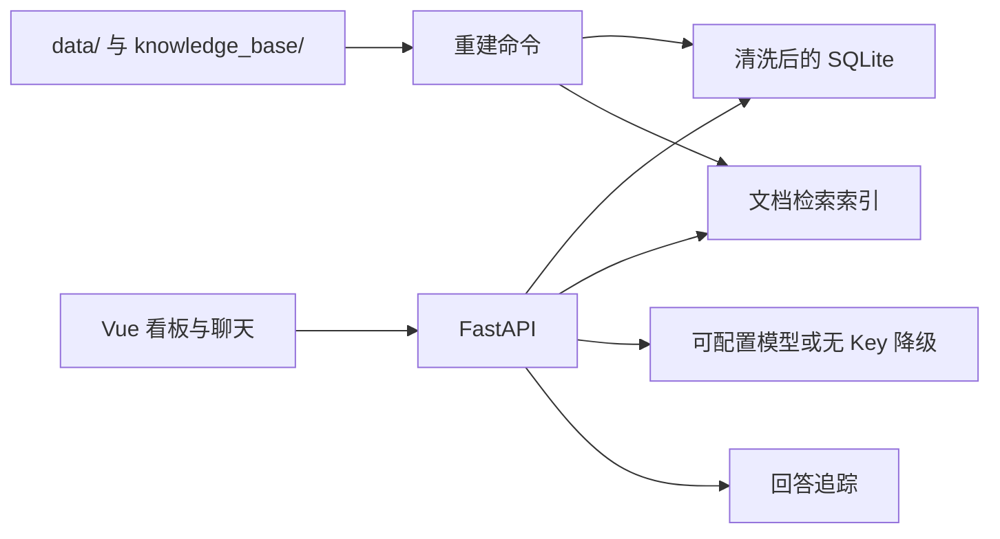

# Moneki 经营看板与混合问答

经营看板和带证据的问答服务。指标按现行 KB-001 从清洗后的销售明细计算，文档答案带逐字引用，没有模型 Key 时仍可启动和评测。

## Windows 一键启动（推荐）

在项目根目录双击 **`start.bat`**。首次运行需要联网，电脑需安装完整版 Python 3.12 和 Node.js 20.19+ 或 22+。

程序自动选择项目 Python 环境，缺少时创建环境并安装依赖；安装前端依赖、构建看板、重建数据与知识库，服务就绪后自动打开浏览器。后续运行会跳过已完成且未变化的依赖安装和前端构建。不需要模型 Key，默认可使用 mock；真实模型配置沿用启动进程的环境变量。

- 保持启动窗口打开，**按 Ctrl+C 停止服务**。
- 默认地址为 `http://127.0.0.1:8000/`；端口已占用时自动选择空闲端口，以窗口显示和自动打开的地址为准。
- 同一项目的一键启动程序只允许运行一个实例。
- 失败时窗口保留错误；后端日志在 `work/launcher/server.log`。启动器生成的数据和索引放在 `work/launcher/`，与手动运行的默认缓存分开。
- 找不到完整版 Python 时会显示安装命令。不要使用缺少 `venv` 的嵌入式 Python。
- PowerShell 执行策略参数仅用于本次启动进程，不修改系统执行策略。

也可在项目根目录的 PowerShell 执行：

```powershell
.\start.bat
# 无浏览器启动
.\start.bat --no-browser
# 自动检查健康接口和首页，成功后退出并清理本次服务
.\start.bat --smoke-test --no-browser
```

## 三步手动启动

需要完整版 Python 3.12、Node.js 20.19+ 或 22+。PowerShell 从仓库根目录开始：

1. 建立后端环境并安装依赖。

```powershell
python -m venv starter/.venv
.\starter\.venv\Scripts\python.exe -m pip install --upgrade pip
.\starter\.venv\Scripts\python.exe -m pip install -r starter/requirements.txt
```

2. 安装并构建看板。

```powershell
npm --prefix frontend ci
npm --prefix frontend run build
```

3. 重建数据和索引，启动服务。

```powershell
cd starter
.\.venv\Scripts\python.exe -m kbqa.rebuild
.\.venv\Scripts\python.exe -m uvicorn kbqa.server:app --host 127.0.0.1 --port 8000
```

打开 [经营看板](http://127.0.0.1:8000/)。构建后的前端由 FastAPI 同端口提供；无需另开前端服务器。系统“今天”固定为 2026-09-01。
Windows 上如果 `python` 指向缺少 `venv` 的精简运行时，第一步改用已安装的 Python 3.12 完整路径；之后始终使用 `.venv` 内的解释器。

更换 `data/` 或 `knowledge_base/` 后，先停止服务，在 `starter/` 执行 `.\.venv\Scripts\python.exe -m kbqa.rebuild`，再重启。索引键包含知识库文件字节，增删改文档后缓存会失效。不要把 API Key 写进仓库。

macOS/Linux 将解释器路径改为 `starter/.venv/bin/python`（进入 starter 后为 `.venv/bin/python`），其余命令相同。开发时可另开终端，从根目录运行 `npm --prefix frontend run dev`，访问 `http://127.0.0.1:5173/`，代理到后端 8000。

## 评测

以下命令均从仓库根目录执行。自动脚本使用临时缓存和空闲端口，不需要手动启动后端，不会停止已有服务：

```powershell
.\starter\.venv\Scripts\python.exe -m pytest starter/tests -q
.\starter\.venv\Scripts\python.exe scripts/verify.py eval
.\starter\.venv\Scripts\python.exe scripts/verify.py preflight
```

2026-09-26 无 Key 全量公开题 **100.00 / 100.00、55/55**，模型协议预检 **14/14**。本地原始报告在 `starter/var/audit-eval/` 和 `starter/var/audit-preflight/`。提交证据与代码版本见 [EVAL_REPORT.md](EVAL_REPORT.md)。GitHub Actions 同样执行这些检查，公开题掉分会使 CI 失败。

接入 DeepSeek 时设置 `LLM_BASE_URL`、`LLM_API_KEY`、`LLM_MODEL` 后重启服务。地址原样拼接 `/chat/completions`，不补 `/v1`。预检步骤见 `LLM_SETUP.md`。

## 目录

| 路径 | 用途 |
| --- | --- |
| `data/pos.db` | 原始销售库，清洗时只读 |
| `knowledge_base/` | KB 文档；`README.md` 不进索引 |
| `starter/kbqa/` | FastAPI 服务：清洗、指标、检索、问答、trace |
| `frontend/` | Vue 3 看板：日期和门店筛选、趋势、Top 10、数据质量、问答和 trace |
| `eval/` | 官方公开评测和 LLM 预检 |
| `docs/API_CONTRACT.md` | 接口契约 |

清洗结果在 `starter/var/clean.db`，索引在 `starter/.cache/index.json`，两者都已忽略，由重建命令生成。

## 架构与选型



沿用官方 Python starter，保留逐层定位和修复缺陷的过程；SQLite 适合这份本地 POS 数据，查询保持只读。文档检索使用可重建的本地索引，不依赖额外的向量服务或 Key；前端用 Vue 3 与 ECharts 展示趋势和证据。模型地址、名称和 Key 从环境变量读取，未配置 Key 时仍能运行指标、检索和降级问答。

live 模式允许模型多轮选择工具探索问题，保留默认思考模式，不发送无效的 temperature 等参数；最终经营数字由代码查询、计算并渲染，文档事实由检索原文抽取。模型自由文本只留在 trace 中供核查，不直接作为已验证事实显示。这样牺牲了一部分开放式措辞能力，换取数字和引用可复算。模型失败会明确拒答，不伪装成 live 成功。

前端可展开每条数据证据和 trace 步骤，查看改写、检索得分、过滤原因、查询结果、耗时及完整模型请求/输出（UI 隐藏 reasoning_content）。每次“新对话”生成独立 session。

口径以当前有效的 KB-001 为准：先规范化并按规定顺序剔除，再用销售和退款行计算净营业额；有效订单数按销售行的不同订单号计；退款按退款行日期归属。数据库与周报估算值冲突时，以数据库查询为准。历史规定按问题所指时间选版本；超出销售数据期间的问题说明没有数据，不把缺失数据表述为零营业额。

## 当前限制

- 没有配置真实模型 Key，因此没有跑过真实 DeepSeek 的全量评测。无 Key 路径和假模型预检都已跑过。
- `run_sql` 只接受只读 `SELECT` / `WITH`。
- 中文检索用二字切分，不是分词器词典。
- 这是本地评审应用，默认只监听 127.0.0.1；没有账号、权限、TLS 或公网限流，不应直接暴露为公共服务。trace 含业务问句和调试上下文，应按业务数据保管。
- 问答对领域外或证据不足的问题会拒答；每日明细回答只列前七天，完整曲线在看板。未声称通过未知隐藏题或不存在任何漏洞。

官方要求保存在 [UPSTREAM_README.md](UPSTREAM_README.md)。调查过程、使用记录和演示分别见 [DEBUG_LOG.md](DEBUG_LOG.md)、[AI_USAGE.md](AI_USAGE.md)、[DEMO.md](DEMO.md)。
